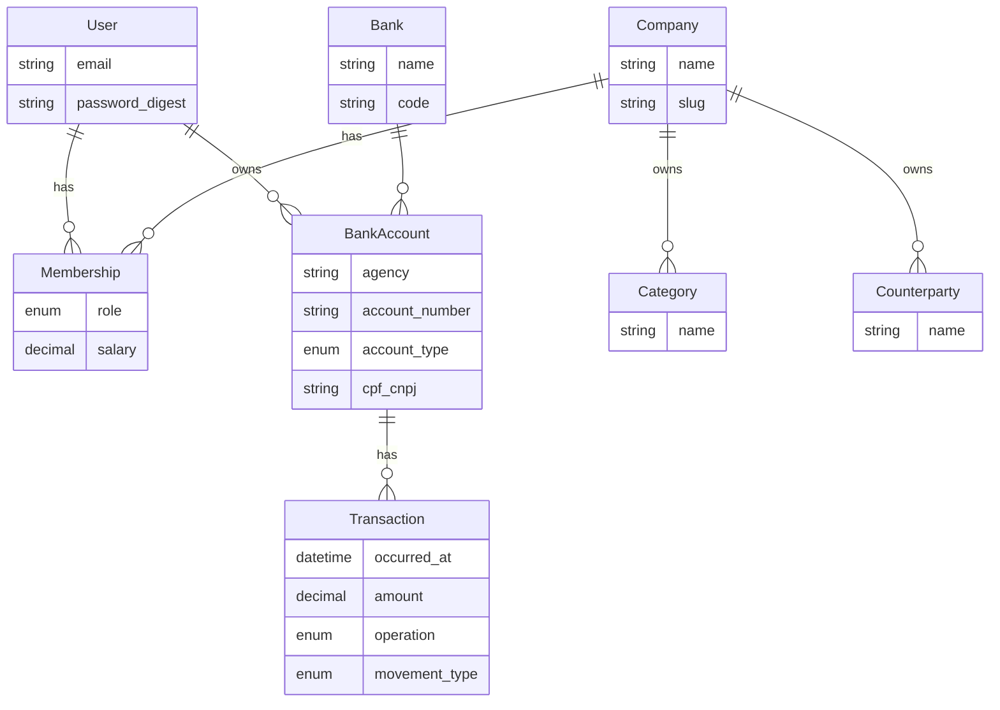

# economizei — Agent Identity

## Project

Financial management application. The main goal is to help users balance their finances within one or more companies (tenants).

## Stack

- **Language:** Rust 1.95 (see `mise.toml`)
- **Framework:** [Doido](https://github.com/) 0.0.24 — Rails-inspired, Axum + SeaORM
- **Auth:** [doido-auth](https://github.com/) 0.0.24 — Devise + OmniAuth + JWT analogue
- **CSS:** [Tailwind CSS](https://tailwindcss.com/) v4 — base styling library (compiled to static assets)
- **JS/TS toolchain:** [Bun](https://bun.sh/) — package manager and script runner for TypeScript, Tailwind, and frontend tooling
- **Database:** PostgreSQL
- **Details:** see [README.md](README.md)

## Essential Commands

| Command | Purpose |
|---------|---------|
| `doido server` | Start HTTP server (port 3000) |
| `doido db create` | Create database |
| `doido db migrate` | Run pending migrations |
| `doido generate model <Name> field:type ...` | Generate model + migration |
| `doido generate controller <Name>` | Generate controller |
| `doido routes` | Print route table |
| `cargo test` | Run tests |
| `cargo fmt` | Format Rust code |
| `bun install` | Install frontend dependencies (Tailwind, TypeScript, etc.) |
| `bun run css:build` | Compile Tailwind CSS to `public/assets/application.css` |
| `bun run css:watch` | Watch and rebuild Tailwind during development |
| `docker compose up` | Start PostgreSQL dev stack |

## Authentication (doido-auth)

Authentication is handled by **doido-auth**. Identity (`User`) is global; tenant scoping is applied separately via `Company` (see Multitenancy below).

### Configuration

Auth settings live under the `auth:` section in `config/<env>.yml` (see `config/development.yml`):

| Key | Purpose |
|-----|---------|
| `user_model` | SeaORM model name implementing `AuthUser` (`User`) |
| `modules` | Devise-style feature modules (`database_authenticatable`, `registerable`, `recoverable`, `rememberable`, `validatable`, …) |
| `strategies` | Enabled strategies, consulted in order (`cookie`, `jwt`, custom) |
| `jwt` | Bearer token settings when `jwt` strategy is enabled |
| `oauth` | OAuth/OAuth2 provider credentials |
| `two_factor` | TOTP settings |
| `timeout` | Idle session timeout in seconds (`timeoutable` module) |
| `password_length` | Minimum password length (`validatable` module) |
| `maximum_attempts` / `unlock_in` | Lockable account settings |
| `reset_password_within` | Password-reset token TTL in seconds (`recoverable` module) |
| `remember_for` | Remember-me cookie TTL in seconds (`rememberable` module) |
| `routes` | Devise-style path prefix and segments (default prefix `/users`) |

Boot-time state is built from this config (`doido_auth::init` / `AuthState`).

### User model contract

`app/models/user.rs` implements:

- [`AuthUser`](https://docs.rs/doido-auth) — `id`, `email`, `password_digest`, `find_by_email`, `find_by_id`
- [`HasSecurePassword`](https://docs.rs/doido-model) — bcrypt via `authenticate` / `hash_password`

The `users` table stores credentials only (`email`, `password_digest`, timestamps). It is **not** tenant-scoped.

### Session strategy (default)

| Item | Value |
|------|-------|
| Cookie | `_doido_session` (encrypted, HttpOnly, SameSite=Lax) |
| Session key | `user_id` |
| Helpers | `doido_auth::sign_in`, `sign_out`, `authenticate`, `register_user` |

### Request extractors & middleware

| Type | Role |
|------|------|
| `CurrentUser<U>` | Requires authenticated user loaded from DB |
| `MaybeUser<U>` | Optional user — never fails the request |
| `RequireAuth` | Requires identity without loading the full model |
| `AuthToken` | Raw bearer token from `Authorization` header |
| `auth_layer` | Resolves identity via enabled strategies and stores `AuthIdentity` in request extensions |

### App wiring

```
app/controllers/auth/
├── sessions_controller.rs      ← sign in / sign out (HTML forms)
├── registrations_controller.rs ← sign up
├── passwords_controller.rs     ← password reset (stub)
└── oauth_controller.rs         ← OAuth redirect/callback (stub)

app/views/auth/                 ← sign_in, sign_up, password templates
config/routes.rs                  ← Devise-style auth routes
config/<env>.yml                  ← auth: section
```

Controllers call `doido_auth` helpers on success; HTML views render validation errors. JSON/API consumers can use `doido_auth::routes::mount` for pre-built JSON endpoints instead of the HTML controllers.

Optional strategies (enable in config when needed):

- **JWT** — `Authorization: Bearer <token>`; sign-in returns token pair when `jwt` is listed in `strategies`
- **OAuth** — `GET /auth/{provider}` and `GET /auth/{provider}/callback`
- **2FA** — TOTP enrollment and verification (`auth-2fa` feature)

## Frontend & UI

All HTML views use **Tailwind CSS** as the base styling library, a **sidebar layout** for authenticated pages, and **Ubuntu Monospace** as the primary typeface. Frontend tooling is managed with **Bun** (not npm/yarn/pnpm).

### Bun toolchain

- **Bun** is the sole JS/TS package manager and script runner for this project.
- Dependencies and scripts live in `package.json`; lockfile is `bun.lock` (commit both).
- Use `bun add <pkg>` / `bun add -d <pkg>` to install packages — do not use npm, yarn, or pnpm.
- TypeScript config: `tsconfig.json` (strict mode); run type checks via `bun run typecheck` when defined.
- Do not commit `node_modules/` — Bun installs locally via `bun install`.

### Tailwind CSS

- Tailwind is the **only** base CSS library — no Bootstrap, custom reset sheets, or ad-hoc global CSS beyond Tailwind layers.
- Source: `app/assets/stylesheets/application.css` (`@import "tailwindcss"` + `@theme` tokens).
- Output: `public/assets/application.css` (served as a static asset).
- Scan paths must include all Tera templates under `app/views/` so utility classes are not purged.
- Prefer Tailwind utilities in templates; extract repeated patterns into small partials, not large custom CSS files.
- Auth pages (sign-in, sign-up, password reset) may use a centered card layout without the sidebar.

### Typography

- **Primary font:** [Ubuntu Monospace](https://fonts.google.com/specimen/Ubuntu+Mono) — loaded via Google Fonts in the application layout.
- Apply to the document root (`font-mono` / `--font-sans` mapped to Ubuntu Monospace in `@theme`).
- Use the same family for headings, body text, forms, tables, and navigation — no secondary display font unless explicitly requested later.

### Sidebar layout

Authenticated pages extend a shared layout with a fixed sidebar + scrollable main content area. The sidebar is **not** a full catalog of every API resource — it exposes only user-facing navigation:

| Link | Path | Purpose |
|------|------|---------|
| Dashboard | `/` | Home |
| Bank accounts | `/me/bank_accounts` | List user-owned accounts (create/edit via buttons on that page) |
| CSV imports | `/me/bank_statement_imports` | Import Nubank/C6 checking account and credit card CSV statements |
| Transactions | `/companies/{company_id}/transactions` | List company transactions (create/edit via buttons on that page; uses session `current_company_id`) |
| Company users | `/me/company_users` | List users with access to the current company |
| Reports | `/companies/{company_id}/reports/*` | Financial health and spending goals |

Create and edit actions for bank accounts and transactions live on their index pages (not in the sidebar): **New** in the page header, **Edit** per row in the table.

**Not in the sidebar** (by design):

- **Companies** — not publicly listable or mutable; provisioned via backoffice/seeds only
- **Banks** — global reference list managed by backoffice; read-only API (`index`, `show`, `export`) without create/update/destroy routes
- **Categories / counterparties** — company-scoped CRUD exists for API use but no sidebar entry yet

Baseline structure:

- `<aside>` — fixed width (~16rem), full viewport height, vertical nav links, active-state styling, company switcher placeholder.
- `<main>` — flexible width, padded content region for ``.
- Responsive baseline: sidebar visible on `md+`; collapsible drawer on small screens (future enhancement).

Layout partials live under `app/views/layouts/` (e.g. `_sidebar.html.tera`, `_paginator.html.tera`).

### Tables & paginator

Every HTML view that renders a **data table** must include the shared paginator partial (`app/views/layouts/_paginator.html.tera`) below the table. The paginator must:

- Offer page-size choices **20**, **50**, and **100** only (matching API allowed values).
- Default to **20** rows when no `per_page` is present.
- Link prev/next pages preserving `per_page`.
- Include an **Export CSV** link pointing to the resource's `/export` collection route.
- Use i18n keys under `pagination.*` in `config/locales/`.

Pass `base_path`, `export_path`, and a `pagination` object (`page`, `per_page`, `total_pages`, `total_count`) from the controller/view context.

### Content negotiation (HTML vs JSON)

Index/list actions use Doido `respond_to`:

| Request | Response |
|---------|----------|
| Browser navigation (`Accept: text/html` or default `Any`) | HTML table view with sidebar layout + paginator |
| API client (`Accept: application/json` or `*.json` path) | Paginated JSON envelope (`data` + `pagination`) |

Implementation: `app/services/listing.rs` (`respond_index`). Views live under `app/views/<resource>/index.html.tera`.

### Static assets

```
app/assets/stylesheets/application.css   ← Tailwind source
public/assets/application.css            ← compiled output (git-tracked or built in CI)
tailwind.config.ts                       ← content paths + theme extensions
package.json                             ← scripts and dependencies (managed by Bun)
bun.lock                                 ← Bun lockfile
tsconfig.json                            ← TypeScript configuration
```

The application layout must link `/assets/application.css` and the Ubuntu Monospace font stylesheet. Build CSS with `bun run css:build` before deploy or when templates/styles change.

## Multitenancy

The app uses **shared-database, row-level isolation**. **`Company` is the tenant model** — categories, counterparties, transactions, and reports belong to a company. **Bank accounts belong to users** and are accessed independently of tenant context.

### Rules

- `User` is global (authentication only).
- `Company` owns tenant-scoped records (categories, counterparties, transactions, reports).
- `Membership` links a user to a company with a role; access checks go through membership.
- `BankAccount` belongs to `User` — each user manages their own accounts; not company-owned.
- Every tenant-scoped query **must** filter by `company_id`.
- Controllers must verify the current user is a member of the target company before read/write tenant data.
- Bank account queries **must** filter by `user_id` (only the owner can access their accounts).
- `Bank` is a global reference list (not tenant-scoped).

### Tenant context

The active company for a request is resolved from session (`current_company_id`) or an explicit route parameter. Baseline: after sign-in, default to the user's first membership; allow switching companies in-session.

## Pagination & CSV export

Every **index/list action** supports pagination query params. **HTML** is the default for browser requests; **JSON** is returned when the client negotiates JSON (see [Content negotiation](#content-negotiation-html-vs-json)). CSV export routes return the full scoped dataset (not paginated) as a downloadable file.

### Query parameters

| Param | Default | Allowed values | Hard limit |
|-------|---------|----------------|------------|
| `page` | `1` | positive integer | — |
| `per_page` | `20` | `20`, `50`, `100` only | **100 max** — cannot be overridden by clients or config |

Rules:

- Listing endpoints **must** accept `page` and `per_page` query params.
- When `per_page` is omitted, the server uses **`20`**.
- When `per_page` is not exactly `20`, `50`, or `100`, fall back to **`20`**.
- The system **never** returns more than **100** records per page — there is no override mechanism.
- Implementation lives in `app/services/pagination.rs`; controllers call `pagination::from_context` and `pagination::fetch`.

### JSON response envelope

```json
{
  "data": [ /* records */ ],
  "pagination": {
    "page": 1,
    "per_page": 20,
    "total_count": 153,
    "total_pages": 8
  }
}
```

### CSV export

Each listable resource exposes a collection export route (`GET …/export`) that returns `text/csv` with `Content-Disposition: attachment`. Implementation lives in `app/services/csv.rs`. Export queries use the same auth/tenant scoping as the index action but return **all** matching rows.

| Resource | Export path | Notes |
|----------|-------------|-------|
| Banks | `GET /banks/export` | Backoffice reference; no public CRUD in routes |
| Bank accounts | `GET /me/bank_accounts/export` | User-scoped |
| Bank statement imports | `GET /me/bank_statement_imports/export` | User-scoped metadata only (no compressed blob) |
| Categories | `GET /companies/{company_id}/categories/export` | Company-scoped |
| Counterparties | `GET /companies/{company_id}/counterparties/export` | Company-scoped |
| Transactions | `GET /companies/{company_id}/transactions/export` | Company-scoped |
| Company users | — | `GET /me/company_users` (paginated HTML/JSON; no CSV yet) |

**Not exposed:** companies list/create/delete, memberships CRUD — companies are provisioned outside the public app.

## API Endpoints

### Auth (doido-auth)

| Method | Path | Description |
|--------|------|-------------|
| GET | `/users/sign_in` | Sign-in form |
| POST | `/users/sign_in` | Session login |
| DELETE | `/users/sign_out` | Session logout |
| GET | `/users/sign_up` | Sign-up form |
| POST | `/users/sign_up` | Create account |
| POST | `/users/password` | Request password reset |
| PATCH | `/users/password` | Update password with reset token |
| GET | `/auth/{provider}` | OAuth authorize redirect |
| GET | `/auth/{provider}/callback` | OAuth callback |

### Profile & tenant

List endpoints accept `?page=1&per_page=20|50|100` (default `per_page=20`). See [Pagination & CSV export](#pagination--csv-export).

| Method | Path | Description |
|--------|------|-------------|
| GET | `/me` | Current user profile + memberships |
| GET | `/me/company_users` | Paginated list of users with access to the **current company** (session `current_company_id`) |
| PATCH | `/me/memberships/{id}/salary` | Update salary for a company membership |
| CRUD | `/me/bank_accounts` | Current user's bank accounts (paginated index; HTML `new`/`edit` forms) |
| GET | `/me/bank_accounts/export` | Export bank accounts as CSV |
| CRUD | `/me/bank_statement_imports` | Import and track Nubank/C6 CSV statements (except `edit`/`update`/`destroy`) |
| GET | `/me/bank_statement_imports/export` | Export import metadata as CSV |
| POST | `/me/bank_statement_imports` | Upload CSV (`csv_content` form field or JSON `content_base64`); creates transactions in current company |

**Companies are not publicly accessible** — no list, create, update, or delete routes. Tenant records are provisioned via backoffice/seeds; the active company is stored in session after sign-in.

### Financial data

Bank accounts are user-scoped; other resources are company-scoped. `{company_id}` is the tenant key. List endpoints accept `?page=1&per_page=20|50|100` (default `per_page=20`).

| Method | Path | Description |
|--------|------|-------------|
| GET | `/banks` | Bank reference list (read-only; paginated index) |
| GET | `/banks/{id}` | Show bank |
| GET | `/banks/export` | Export banks as CSV |
| CRUD | `/companies/{company_id}/categories` | Transaction categories (requires membership; paginated index) |
| GET | `/companies/{company_id}/categories/export` | Export categories as CSV |
| CRUD | `/companies/{company_id}/counterparties` | Counterparties (requires membership; paginated index) |
| GET | `/companies/{company_id}/counterparties/export` | Export counterparties as CSV |
| CRUD | `/companies/{company_id}/transactions` | Transactions (requires membership; paginated index; HTML `new`/`edit`; bank account must belong to current user) |
| GET | `/companies/{company_id}/transactions/export` | Export transactions as CSV |
| GET | `/companies/{company_id}/reports/health` | Financial health report |
| GET | `/companies/{company_id}/reports/spending_goals` | Spending goals report |

**Banks:** no public create/update/destroy routes — the list is fixed and managed by backoffice.

## Bank statement CSV imports

Users can import checking account and credit card CSV exports from **Nubank** and **C6 Bank**. Each upload is tied to one of the user's bank accounts and creates company-scoped transactions in the session's current company.

### Model: `BankStatementImport`

Tracks every imported file in `bank_statement_imports`:

| Field | Purpose |
|-------|---------|
| `user_id`, `bank_account_id`, `company_id` | Ownership and tenant scope |
| `source` | `nubank` or `c6` |
| `statement_type` | `checking_account` or `credit_card` |
| `original_filename` | Client-provided file name |
| `compressed_data` | Original CSV stored as **gzip** (`flate2`) |
| `file_checksum` | SHA-256 of raw file — unique per `bank_account_id` (re-import blocked) |
| `transactions_imported`, `status`, `error_message` | Import outcome |

### Parsers

Implementation lives in `app/services/imports/`:

| Source | Checking account columns | Credit card columns |
|--------|-------------------------|-------------------|
| Nubank | `date`/`Data`, `title`/`Descrição`, `amount`/`Valor` | `date`, `title`/`Estabelecimento`, `amount`/`Valor`, `category`/`Categoria` |
| C6 | Same layouts as Nubank (Portuguese or English headers) | Same layouts as Nubank |

Parsed rows become `Transaction` records:

- `movement_type`: `balance` for checking account, `credit_card` for card statements
- `operation`: inferred from signed amount (checking) or charge/refund (card)
- `category`: from CSV when present, otherwise default i18n category `imports.default_category`
- `counterparty`: created/found from description

### API usage (JSON)

```json
POST /me/bank_statement_imports
{
  "bank_account_id": 1,
  "source": "nubank",
  "statement_type": "credit_card",
  "original_filename": "fatura.csv",
  "content_base64": "<base64-encoded CSV>"
}
```

## Repository Layout

```
economizei/
├── app/
│   ├── assets/
│   │   └── stylesheets/   ← Tailwind source (`application.css`)
│   ├── controllers/
│   │   └── auth/          ← doido-auth HTML controllers
│   ├── models/            ← model extensions (safe to edit); SeaORM entities in `_entities/`
│   ├── services/          ← auth, tenant, pagination, csv, imports, reports, i18n
│   ├── views/
│   │   ├── layouts/       ← application layout, sidebar, paginator partials
│   │   ├── auth/          ← sign-in, sign-up, password templates
│   │   ├── banks/         ← HTML index tables
│   │   ├── companies/
│   │   └── …              ← one index view per listable resource
│   ├── jobs/              ← Background jobs
│   └── mailers/           ← Email templates
├── public/
│   └── assets/            ← compiled CSS and static files
├── config/                ← application.toml, routes.rs, env overrides
├── db/migration/          ← SeaORM migration crate (immutable history)
├── package.json           ← frontend scripts and dependencies
├── bun.lock               ← Bun lockfile
├── tsconfig.json          ← TypeScript configuration
├── tailwind.config.ts     ← Tailwind content paths and theme
└── tests/                 ← Integration tests
```

## Global Rules

- Code, identifiers, and comments must be in **English**
- User-facing strings must use **i18n** (never hardcoded in controllers/views)
- **Minimum test coverage: 80%** — new features and changes must keep total project coverage at or above 80%; run `cargo test` and verify coverage before merging
- **Never modify** existing migration files after they are created — add a new migration instead
- **Tenant isolation:** never query or mutate tenant-scoped models without a verified `company_id` filter
- **Bank account ownership:** never query or mutate bank accounts without a verified `user_id` filter matching the current user
- **Styling:** use Tailwind utilities only; do not add parallel CSS frameworks or inline `<style>` blocks in templates
- **Layout:** authenticated HTML pages must use the sidebar layout; auth guest pages use the centered card variant
- **Typography:** Ubuntu Monospace is the primary font across all UI surfaces
- **Frontend tooling:** use Bun for package management and scripts — never npm, yarn, or pnpm
- **Pagination:** all list/index actions accept `page` and `per_page`; HTML table for browsers, JSON envelope for API clients
- **CSV export:** every listable resource must expose a scoped `GET …/export` route
- **CSV import:** Nubank and C6 checking/credit card statements via `BankStatementImport`; gzip-compressed originals stored in DB
- **HTML tables:** every table view must render `_paginator.html.tera` with export link and page-size selector

## Domain Model

Users authenticate globally, join one or more companies via memberships, and manage finances within each company tenant.



### Entities

| Entity | Scope | Fields / Rules |
|--------|-------|----------------|
| **User** | Global | Authenticated via doido-auth; `email`, `password_digest`; owns bank accounts |
| **Company** | Tenant | `name`, `slug` — root tenant record |
| **Membership** | Join | `user_id`, `company_id`, `role` (owner \| admin \| member), `salary` |
| **Bank** | Global | `name`, `code` — reference list of banks |
| **BankAccount** | User | `user_id`, `bank_id`, `agency`, `account_number`, `account_type` (corrente \| investimento), `cpf_cnpj`; balance and credit card movements |
| **Category** | Tenant | `company_id`, `name` — transaction category |
| **Counterparty** | Tenant | `company_id`, `name` — institution or person on the other side of a transaction |
| **Transaction** | Tenant | `company_id`, `occurred_at`, `bank_account` (required, must belong to current user), `amount`, `operation` (ENTRADA \| SAIDA), `category`, `movement_type` (`balance` \| `credit_card`) |

### Reports

Scoped to a company tenant:

- **Financial health report** — overall financial wellness indicators for the company
- **Spending goals report** — spending targets to reach financial health

## Open Questions (TODO)

These domain rules use baseline defaults; refine as needed:

- [x] Authentication strategy — doido-auth with encrypted session cookie (`_doido_session`) and optional JWT/OAuth/2FA
- [x] i18n locales — `en` and `pt-BR` in `config/locales/`
- [x] Credit card vs balance — `movement_type`: `balance` or `credit_card` on transactions
- [x] Multitenancy — shared DB, row-level isolation; `Company` is the tenant model
- [x] Frontend stack — Tailwind CSS, sidebar layout, Ubuntu Monospace primary font, Bun toolchain
- [x] Test coverage — minimum 80% project-wide
- [x] Pagination — all list APIs paginated (`per_page` default 20; allowed 20/50/100; max 100 hard cap)
- [x] CSV export — collection `/export` routes for all listable resources
- [x] HTML table paginator — shared `_paginator.html.tera` partial required on every table view
- [ ] Tenant context resolution — session `current_company_id` vs subdomain/slug routing
- [ ] Membership roles — baseline: owner creates company; admin/member permissions TBD
- [ ] Financial health report formula — baseline: savings rate + expense ratio (see `app/services/reports.rs`)
- [ ] Spending goals — baseline: equal category split, 20% savings target (see `app/services/reports.rs`)

## Agent Harness

Detailed workflows live in `.cursor/` (progressive disclosure):

| Layer | Location | Purpose |
|-------|----------|---------|
| Rules | `.cursor/rules/` | Guardrails (standards, Doido conventions, migrations, domain) |
| Skills | `.cursor/skills/` | Workflows: add model, add migration, financial reports, verify changes |
| Hooks | `.cursor/hooks/` | Automation: fmt, migration protection, test hints |
