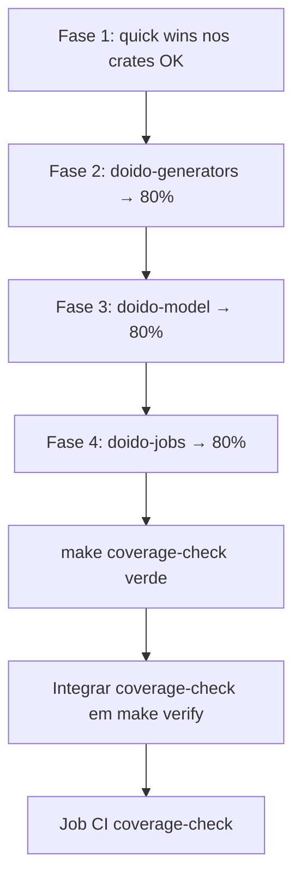

# Plano de cobertura de testes — meta 80%

Baseline medido em **2026-07-29** com `cargo llvm-cov --workspace` (backends
in-memory apenas; redis/postgres/memcache não exercitados).

## Decisões (2026-07-29)

| Decisão | Escolha |
|---------|---------|
| Escopo do limiar | **80% por crate** do workspace |
| Backends feature-gated | **Incluir no gate** — CI com `docker compose` + `make test-backends` |
| Integração em `verify` | **Somente quando todos os crates passarem** (verify permanece verde durante a implementação) |

## Métrica e gate

| Item | Valor |
|------|-------|
| Ferramenta | [`cargo-llvm-cov`](https://github.com/taiki-e/cargo-llvm-cov) |
| Métrica | **Line coverage** (terceira coluna do relatório `summary-only`) |
| Limiar | **80% por crate** (workspace member) |
| Comando local | `make coverage` / `make coverage-check` |
| Backends | `make services-up && make test-backends` antes do gate local |

## Situação atual (por crate)

| Crate | Line coverage | Status | Arquivos `< 80%` |
|-------|--------------:|--------|------------------|
| `doido` | 100.0% | OK | 0 |
| `doido-cache` | 92.3% | OK | 2 |
| `doido-controller` | 89.0% | OK | 3 |
| `doido-core` | 84.0% | OK | 2 |
| `doido-view` | 84.2% | OK | 3 |
| `doido-cable` | 81.8% | OK | 3 |
| `doido-mailer` | 83.3% | OK | 3 |
| `doido-storage` | 82.4% | OK | 5 |
| `doido-generators` | 79.0% | **−0.97 pp** | 12 |
| `doido-model` | 71.3% | **−8.66 pp** | 10 |
| `doido-jobs` | 56.0% | **−24.04 pp** | 2 (+ redis 0%) |
| `doido-auth` | — | **planned** | new crate (spec 16, US-105→US-113); generators owned by crate, CLI-visible only when installed |

**Workspace total:** 82.35% line coverage — acima de 80%, mas **3 crates** ainda abaixo.

Macro crates (`doido-*-macros`) são medidos junto com o crate pai quando testados
via `-p doido-controller` etc.; cobertura individual já está ≥ 80%.

## Fases de implementação (somente testes — sem alterar código de produção)

### Fase 1 — Quick wins (1–2 dias)

Crates já ≥ 80% no total, mas com arquivos pontuais abaixo. Adicionar testes de
integração/unit em `tests/` existentes.

| Crate | Arquivo | Cobertura | Estratégia de teste |
|-------|---------|----------:|---------------------|
| `doido-core` | `inflector/mod.rs` | 50.8% | Exercitar `singularize`/`pluralize`/`camelize`/`underscore`/`classify`/`tableize`/`foreign_key`/`humanize`/`ordinalize`/`dasherize` via casos edge não cobertos |
| `doido-core` | `logger.rs` | 75.8% | Testar níveis de log, formato JSON vs pretty, rotação de subscriber |
| `doido-cache` | `namespaced.rs` | 65.2% | Testar prefixo de namespace, isolamento entre stores |
| `doido-cache` | `registry.rs` | 78.6% | Registrar store nomeado, lookup, erro em nome duplicado |
| `doido-controller` | `secret.rs` | 57.1% | Carregar secret de env vs arquivo, valor ausente |
| `doido-controller` | `env_override.rs` | 78.1% | Overrides aninhados `SECTION__KEY`, tipos inválidos |
| `doido-view` | `tera_engine.rs` | 74.7% | Templates com erro, partials, layout ausente |
| `doido-view` | `global.rs` | 75.6% | Init global do renderer, re-init idempotente |
| `doido-view` | `helpers/form.rs` | 75.6% | Helpers de input/select/checkbox não exercitados |
| `doido-cable` | `config.rs` | 51.1% | Parse YAML de cable, defaults, redis URL |
| `doido-cable` | `pubsub.rs` | 68.8% | Subscribe/broadcast com MemoryPubSub |
| `doido-cable` | `lib.rs` | 0% | Smoke test importando re-exports públicos |
| `doido-mailer` | `config.rs` | 43.3% | Parse de SMTP/sendmail/test delivery |
| `doido-mailer` | `global.rs` | 66.7% | Init global mailer, deliverer default |
| `doido-mailer` | `sendmail.rs` | 76.9% | Mock de sendmail path (tempfile + assert comando) |
| `doido-storage` | `error.rs` | 0% | Construir cada variant de erro e assert Display |
| `doido-storage` | `config.rs` | 69.1% | YAML multi-service, adapter registry |
| `doido-storage` | `service.rs` | 65.7% | Trait object + disk/memory round-trip |
| `doido-storage` | `providers/disk.rs` | 67.4% | Upload/download/delete, path traversal safe |
| `doido-storage` | `attachments.rs` | 75.7% | attach/detach/purge polymorphic |

### Fase 2 — `doido-generators` (2–3 dias)

Crate a **79.0%** — falta ~21 linhas equivalentes ou poucos testes CLI/integration.

| Arquivo | Cobertura | Prioridade | Abordagem |
|---------|----------:|:----------:|-----------|
| `commands/db.rs` | 4.5% | P0 | `assert_cmd` + tempdir: `doido db migrate`, `db:rollback`, `schema:load` com SQLite |
| `commands/server.rs` | 22.7% | P1 | Spawn server em task, request health, shutdown graceful |
| `commands/jobs.rs` | 30.5% | P1 | `doido jobs list/retry/clear` contra MemoryQueue |
| `commands/worker.rs` | 44.4% | P1 | Worker one-shot process job |
| `commands/new.rs` | 46.5% | P0 | Já parcialmente coberto por e2e; expandir flags/options |
| `commands/credentials.rs` | 63.7% | P2 | edit/show com master.key temporário |
| `commands/destroy.rs` | 50.0% | P2 | Generator destroy reverte arquivos |
| `commands/dbconsole.rs` | 63.2% | P3 | Smoke (pode ser `#[ignore]` se interativo) |
| `commands/runner.rs` | 60.0% | P2 | `doido runner script.rs` |
| `cli.rs` | 79.5% | P3 | Subcomandos restantes, `--help` paths |

Reutilizar padrões de `doido-generators/tests/cli_test.rs`, `db_runner_cmd_test.rs`,
`e2e_app_build_test.rs`.

### Fase 3 — `doido-model` (3–4 dias)

Crate mais impactado fora dos geradores: **71.3%**.

| Área | Arquivos | Cobertura | Testes sugeridos |
|------|----------|----------:|------------------|
| Migrations DSL | `migration/column.rs`, `foreign_key.rs`, `index.rs`, `table.rs` | 40–73% | Construir migrations programaticamente e assert SQL gerado |
| ActiveRecord glue | `create.rs`, `callbacks.rs` | 54–62% | save/create/update com callbacks before/after |
| Infra | `pool.rs`, `transaction.rs`, `databases.rs`, `password.rs` | 64–77% | Multi-db config, rollback, bcrypt round-trip |

Seguir convenção existente em `doido-model/tests/*` com SQLite in-memory.

### Fase 4 — `doido-jobs` (2–3 dias)

Crate mais crítico: **56.0%**.

| Arquivo | Cobertura | Abordagem |
|---------|----------:|-----------|
| `redis.rs` | ~0–7% | Testes feature-gated `jobs-redis` + `make services-up` (mesmo padrão de `test-backends`) |
| `callbacks.rs` | 55.0% | before/after perform hooks, abort chain |
| `db.rs` | 86% crate avg mas funções 56% | Expandir testes postgres feature-gated |

**Decisão:** backends redis/postgres entram no gate — CI deve subir serviços via
`docker compose` e rodar `make test-backends` antes de `make coverage-check`.

## Ordem de execução recomendada

Estimativa total: **8–12 dias** de trabalho focado (somente testes).

## Convenções (restritas pelo escopo)

- **Não alterar** código em `src/` dos crates — apenas adicionar/expandir arquivos em
  `tests/` ou `#[cfg(test)]` em arquivos de teste dedicados.
- Preferir testes de integração que exercitam API pública.
- Para CLI: `assert_cmd` + `tempfile` (já vendored).
- Para I/O externo (redis/postgres): `#[ignore]` + documentar em `make test-backends`.
- Rodar `make verify` após cada fase; `make coverage-check` como gate da fase.

## Checklist de conclusão

- [ ] Todos os workspace members ≥ 80% line coverage
- [ ] `make coverage-check` exit 0
- [ ] `make verify` inclui `coverage-check`
- [ ] CI job `coverage` espelha o gate local
- [ ] `harness/progress.txt` registra conclusão da iniciativa
